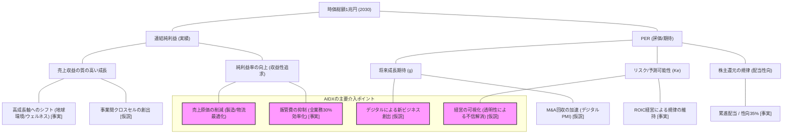

# 時価総額1兆円目標：ロジックツリー（純利益×PERベース）

時価総額1兆円達成に向けた、「利益」と「期待」の分解構造です。

---

## ツリーの解説

### 1. 収益の柱（左側：純利益）
「利益率10%」「業務効率化30%」という経営ノルマを達成し、純利益の絶対額を増やす。
- **AIDXの役割**: 販管費と原価の両面を削り、利益弾力性を高める。

### 2. 期待の柱（右側：PER）
「稼いだ利益」への評価を高める、未来への投資。
- **AIDXの役割**: 200社の不透明性を「データ」で解消し（PERディスカウントの除去）、事業間を繋いだ新サービスで成長期待（g）を上積みする。

---

## 関連ドキュメント
- [[01_Net_Income_Structure]]
- [[02_PER_Expectation_Growth]]
- [[03_Efficiency_Drivers]]
