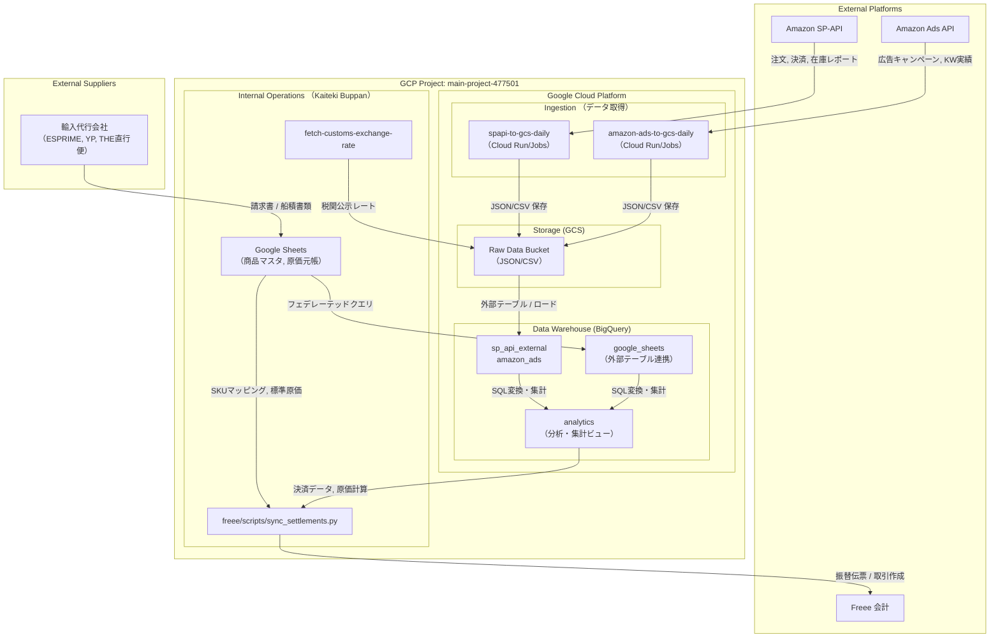

# システムアーキテクチャ

## 概要

本書は、Amazon、BigQuery、Google Sheets、Freee、および各種外部サービスを連携するシステムアーキテクチャを可視化したものです。

## 全体構成図 (Mermaid)

## コンポーネント詳細

### 1. データソース
| ソース | 説明 | 連携方法 |
| :--- | :--- | :--- |
| **Amazon SP-API** | 売上、在庫、決済レポートなど。 | `spapi-to-gcs-daily` (Cloud Run) が毎日/毎週データを取得。 |
| **Amazon Ads API** | 広告パフォーマンスデータ。 | `amazon-ads-to-gcs-daily` (Cloud Run) が取得。 |
| **輸入代行会社** | ESPRIME, YP, THE直行便 からの発注・輸送コスト情報。 | Google Sheets (`agency_ledger`, `po_details`) で管理。 |
| **快適物販 (自社)** | 自社運営（在庫管理、出荷指示など）。 | Google Sheets およびローカルスクリプトで管理。 |
| **Google Sheets** | 商品マスタ (`dim_products`)、マッピング定義、手動入力元帳。 | BigQuery外部テーブルまたはPythonスクリプトから直接参照。 |

### 2. データウェアハウス (BigQuery)
* **sp_api_external / amazon_ads**: GCSからマッピングされた未加工データ層（Raw Data）。
* **google_sheets**: Google Sheetsを直接参照する外部テーブル。
  * `dim_products`: 商品マスタ（SKUマッピング、標準原価）。
  * `agency_ledger`: 代行会社からの原価データ。
* **analytics**: データ変換・集計層。
  * `stg_average_unit_cost`: 発注データ(PO)から算出した平均単価。
  * `settlement_journal_view`: Freee向けに前処理された決済データ（借方・貸方）。

### 3. アプリケーション / スクリプト (Freee連携)
* **freee/scripts/sync_settlements.py**:
  * `dim_products` からSKUマッピングと標準原価を取得。
  * BigQueryから `settlement_journal_view` (決済データ) を取得。
  * 売上原価 (COGS) を計算。
  * Freee API を通じて振替伝票 (Manual Journal) を作成・登録。
* **fetch-customs-exchange-rate**:
  * 週間税関公示レートを取得。
  * GCSにアップロード（BigQueryでの原価計算に使用）。

### 4. Freee 会計システム
* 決済データ（振替伝票）および発注データ（取引）を受信。
* 必要に応じて取引先・品目マスタを同期。

## 主要なデータフロー

1. **売上原価 (COGS) フロー**:
    * 輸入代行会社 -> `agency_ledger` (Sheet) -> BigQuery -> `analytics.stg_average_unit_cost`
    * (現在の実装): `dim_products` (Sheet) -> `sync_settlements.py` (標準原価を利用) -> Freee
2. **売上・決済フロー**:
    * Amazon -> SP-API -> GCS -> BigQuery -> `sync_settlements.py` -> Freee
